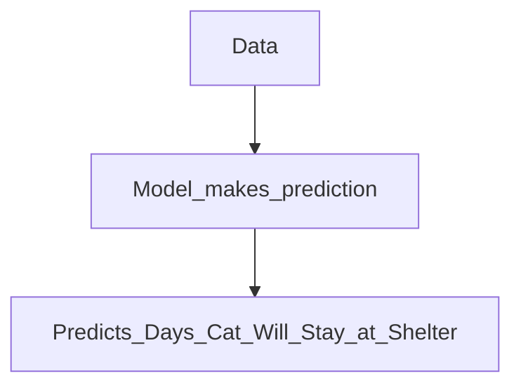

# Furrever Stay
**Link to live demo:** [link](https://furrever-stay.streamlit.app/)

**Link to dataset:** [Austin Animal Center Intakes](https://data.austintexas.gov/Health-and-Community-Services/Austin-Animal-Center-Intakes/wter-evkm/about_data) |
[Austin Animal Center Outcomes](https://data.austintexas.gov/Health-and-Community-Services/Austin-Animal-Center-Outcomes/9t4d-g238/about_data)


**Link to project description:** [link](https://hackmd.io/@H1rmcYbFSwOYUwgYururYA/Sk71PmXxT)

**Link to project plans:** [link](https://docs.google.com/document/d/1AmtaymPJmyJYC26llHr9EapXFngMpI09pPshSX5K-So/edit#heading=h.jn1i75j0vqs6)

**Link to Project Documentation:** [link](https://docs.google.com/document/d/10uG2zbPJXFRg6SaWjSMh_QIm3TamC7SHQGCQRTtZPU0/edit?usp=sharing)


Furrever Stay
===


<h2><b></b>Our motto is "No cat should be left without a loving home or end up being euthanized!"</b></h2>

## Table of Contents
**[Overview and Objectives](#overview-and-objectives)**<br>
**[Motivation](#motivation)**<br>
**[Project Timeline](#project-timeline)**<br>
**[Data Source](#data-source)**<br>
**[Implementation Plan](#implementation-plan)**<br>
**[Methodology](#methodology)**<br>
**[Expected Outcomes](#expected-outcomes)**<br>
**[Models Result](#models-result)**<br>
**[User Flows](#user-flows)**<br>
**[Future Features](#future-features)**<br>
**[Project Review & Feed Back](#project-review-and-feedback)**<br>

## Overview and Objectives

Welcome to ***Furrever Stay***, a project designed to predict the duration a cat may spend in a shelter based on its traits. Our objective is to flag cats at risk, allowing shelters to prioritize those at risk of extended shelter stays for adoption, thereby contributing to the overall well-being of sheltered animals. Inspired by the research paper ["Increasing adoption rates at animal shelters: a two-phase approach to predict length of stay and optimal shelter allocation"](https://bmcvetres.biomedcentral.com/articles/10.1186/s12917-020-02728-2) <span style="color: #e75480;">Furrever Stay</span> aims to enhance the adoption process at animal shelters.

**Project Objectives**
* Predict a cat's stay duration in a shelter using individual traits.
* Assist shelters in prioritizing cats with a higher risk of extended shelter stays for adoption.


## Motivation 
According to ["Euthanasia in Animal Shelters: Management's Perspective on Staff Reactions and Support Programs"](https://www.tandfonline.com/doi/abs/10.2752/175303713X13795775536057), published online on April 28, 2015, about 6–8 million dogs and cats enter animal shelters every year, and 3–4 million of those animals are euthanized. In other words, approximately 50% of the total canines and felines that enter animal shelters are put to death annually. Moreover, 10–25% of the total euthanized population in the United States is explicitly euthanized because of shelter overcrowding each year ["source"](https://jvme.utpjournals.press/doi/10.3138/jvme.30.4.372). 

Even though both cats and dogs are at risk of not getting adopted, for the sake of time and complexity, we will only work with cats for our project at this moment. 
On February 5, 2021,["BMC Veterinary Research"](https://bmcvetres.biomedcentral.com/articles/10.1186/s12917-020-02728-2/figures/3) conducted further evaluation and found that about 24% of cats taken into the shelter were euthanized.

<p></p>

As mentioned above, most euthanasia is done because of shelter overcrowding. When we analyzed ["Sonoma county shelter data"](https://data.sonomacounty.ca.gov/d/924a-vesw/visualization) and ["Long Beach City Shelter data"](https://tinyurl.com/ypt3hdw6), we found that the number of cats taken in has almost doubled from 2020 to 2023. 

<p><h4>From Sonoma County Shelter Data:</h4>

</p>
<p><h4>From Long Beach City Shelter Data:</h4>

</p>
 
This trend of an increased number of cats is common for almost all shelters. Overcrowded shelters are harmful for both shelters and cats. Due to the increased number of cats, the maintenance cost has risen, and because of that, cats are not getting proper care. Animal shelters grapple with optimally distributing resources to care for and rehome animals. In response to this challenge, **Furrever** Stay has emerged with a mission to enhance efficiency by forecasting the duration of a cat's stay and prioritizing those at risk of prolonged residency. By strategically identifying and prioritizing cats during adoption events, we aim to empower shelter caretakers to focus their efforts where they are most needed. Recognizing the limitations of caretaker capacities, this approach not only aids in resource allocation but also significantly boosts adoption rates, ensuring that more cats find their forever homes.

 
## Project Timeline
---


<!--```mermaid
gantt
    dateFormat  YYYY-MM-DD
    title A Gantt Diagram Of FurreverStay

    section Project
    Conceptualization:done, a1, 2023-10-01, 2023-10-06
    Data Collection: done, a2, 2023-10-06, 2023-10-11
    Data Cleaning and Visualization: done, a3, 2023-10-12, 2023-11-01
    Model Development: done, a4, 2023-11-01, 2023-11-15
    Recollection of data and cleaning: done, a5, 2023-11-15, 2023-11-25
    Re-Development model: done, a6, 2023-11-25, 2023-12-03
    Web Interface Development: active, a7, 2023-12-03, 2023-12-11
```
-->

## Data Source

We used the Austin Animal Center Intakes and Outcomes Dataset for our model creation & analysis

[Intakes](https://data.austintexas.gov/Health-and-Community-Services/Austin-Animal-Center-Intakes/wter-evkm/about_data)

[Outcomes](https://data.austintexas.gov/Health-and-Community-Services/Austin-Animal-Center-Outcomes/9t4d-g238/about_data)

**Data Provided By
City of Austin, Texas - data.austintexas.gov**

## Implementation Plan
* Conduct exploratory data analysis on shelter records.
* Preprocess data for model training.
* Train predictive models based on the two-phase approach.
* Evaluate model performance and fine-tune as needed.

## Methodology
Furrever Stay employs **"Random Forest Classification algorithm"** to make predictions for flagging short or long stays of cats in the shelter and **"Gradient Boost Regression algorithm"** for predicting the number of days staying in the shelter.

<p></p>

<p></p>

<p></p>


## Expected Outcomes
* Identification of factors influencing cat shelter stay durations.
* A predictive model for estimating the length of stay for individual cats.

## Models Result:
  ### Randomforest Classification Model results: 
    RandomForestClassifier(max_depth=10, max_features='log2', max_leaf_nodes=10)
    Accuracy Score: 0.728988
    Precision Score: 0.725073
    Recall Score: 0.710626
    F1 Score: 0.717777
    AUC Score: 0.795007
  
  ### Randomforest Classification model Feature importance:
    age_intake_months                 0.503119
    intake_type_owner_surrender       0.149766
    intake_type_stray                 0.114912
    intake_condition_normal           0.092639
    intake_condition_nursing          0.084116
    intake_condition_neonatal         0.028981
    intake_condition_injured          0.011893
    intake_condition_sick             0.008639
    breed_domestic_shorthair          0.001022
    coatcolor_brown                   0.000935
    breed_domestic_shorthair_mix      0.000913
    coatcolor_black                   0.000606
    coatcolor_orange                  0.000399
    sex_intake_female                 0.000316
    coatcolor_white_mix               0.000304
    coatcolor_tortie_or_tortie_mix    0.000302
    coatpattern_tabby                 0.000278
    coatpattern_solid                 0.000268
    coatcolor_torbie_or_torbie_mix    0.000247
    coatcolor_black_n_white           0.000134
    coatcolor_calico_or_calico_mix    0.000104
    intake_condition_pregnant         0.000054
    sex_intake_male                   0.000053
  
  ### Confusion Matrix for Randomforest Classification model:
   

### Gradient boosting Regression Model results: 
    Root Mean Squared Error: 22.348138048104804
    Mean Absolute Error: 17.63593795727246
    R-squared Score: 0.278719
    Adjusted R-squared Score: 0.277662

### Gradient boosting Regression model Feature importance:
    age_intake_months                 0.847322
    intake_condition_normal           0.034542
    intake_type_owner_surrender       0.031185
    intake_type_stray                 0.017724
    breed_domestic_shorthair          0.011614
    intake_condition_nursing          0.009528
    breed_domestic_shorthair_mix      0.009206
    coatcolor_brown                   0.007624
    coatpattern_tabby                 0.005838
    coatcolor_black                   0.005390
    sex_intake_male                   0.003201
    coatpattern_solid                 0.003009
    coatcolor_black_n_white           0.002613
    sex_intake_female                 0.002109
    coatcolor_white_mix               0.001637
    coatcolor_tortie_or_tortie_mix    0.001468
    intake_condition_injured          0.001384
    coatcolor_calico_or_calico_mix    0.001108
    coatcolor_blue                    0.000791
    intake_condition_sick             0.000776
    intake_condition_neonatal         0.000763
    intake_condition_pregnant         0.000584
    coatcolor_torbie_or_torbie_mix    0.000480
    intake_condition_aged             0.000105

## User flows
---


The user will input the characteristics of the cat by using the drop-down menu on the website


After inputting the characteristics, the website will give the user a prediction of how long the cat will stay


## Future Features
Currently, our system allows users to input the characteristics of a single cat for analysis. However, our future objective is to enhance the functionality to process datasets provided by users, such as Excel files in CSV format, enabling the system to generate predictions and insights for multiple cats simultaneously. This expansion will offer users a more efficient experience.

We are also planning to develop PawStay, which will be focused on dogs.

## Project Review and Feedback
**Feed Back Form:** [Link](https://forms.gle/x3aXFBEivjzpbfEq8)<br>
**See Previous Reviews:** [Link](https://docs.google.com/spreadsheets/d/1WqtQEKTo0lP-vFTR447fsURatLueAe8r4adIjMUvt0o/edit?usp=sharing)

license Furrever Stay

