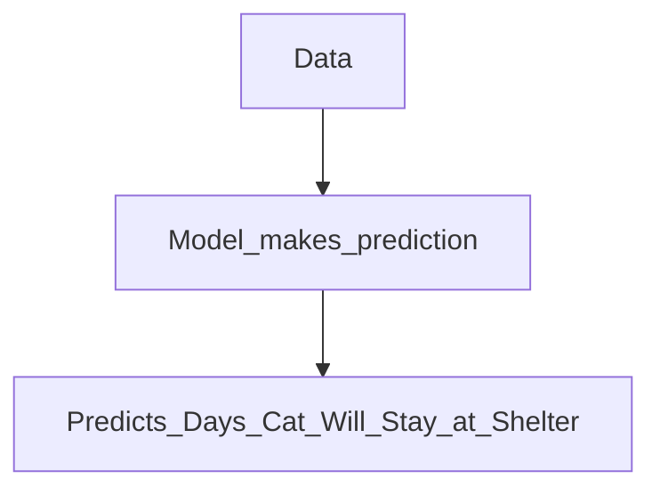
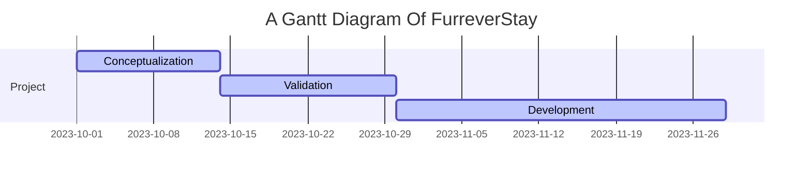

# team-3
**Link to live demo:** [link](https://furrever-stay.streamlit.app/)

**Link to dataset:** [Link to project dataset](//add texas dataset link here)

**Link to project description:** [link](https://hackmd.io/@H1rmcYbFSwOYUwgYururYA/Sk71PmXxT)

**Link to project plans:** [link](https://docs.google.com/document/d/1AmtaymPJmyJYC26llHr9EapXFngMpI09pPshSX5K-So/edit#heading=h.jn1i75j0vqs6)

Furrever Stay
===

<h2><b></b>No cat should be left without a loving home or end up being euthanized!</b></h2>

## Table of Contents
**[Overview and Objectives](#overview-and-objectives)** 
**[Motivation](#motivation)** 
**[User Flows](#user-flows)** 
**[Project Timeline](#project-timeline)** 
**[Data Source](#data-source)** 
**[Methodology](#methodology)** 
**[Expected Outcomes](#expected-outcomes)** 
**[Implementation Plan](#implementation-plan)** 
**[Future Features](#future-features)** 

## Overview and Objectives

Welcome to ***Furrever Stay***, a project designed to predict the duration a cat may spend in a shelter based on its traits. Our objective is to flag cats at risk, allowing shelters to prioritize those at risk of extended shelter stays for adoption, thereby contributing to the overall well-being of sheltered animals. Inspired by the research paper ["Increasing adoption rates at animal shelters: a two-phase approach to predict length of stay and optimal shelter allocation"](https://https://bmcvetres.biomedcentral.com/articles/10.1186/s12917-020-02728-2) Furrever Stay aims to enhance the adoption process at animal shelters.

**Project Objectives**
* Predict a cat's stay duration in a shelter using individual traits.
* Assist shelters in prioritizing cats with a higher risk of extended shelter stays for adoption.

## Motivation 
According to ["Euthanasia in Animal Shelters: Management's Perspective on Staff Reactions and Support Programs"](https://www.tandfonline.com/doi/abs/10.2752/175303713X13795775536057), published online on April 28, 2015, about 6–8 million dogs and cats enter animal shelters every year, and 3–4 million of those animals are euthanized. In other words, approximately 50% of the total canines and felines that enter animal shelters are put to death annually. Moreover, 10–25% of the total euthanized population in the United States is explicitly euthanized because of shelter overcrowding each year ["source"](https://jvme.utpjournals.press/doi/10.3138/jvme.30.4.372). 

Even though both cats and dogs are at risk of not getting adopted, for the sake of time and complexity, we will only work with cats for our project at this moment. 
On February 5, 2021,["BMC Veterinary Research"](https://bmcvetres.biomedcentral.com/articles/10.1186/s12917-020-02728-2/figures/3) conducted further evaluation and found that about 24% of cats taken into the shelter were euthanized.

As mentioned above, most euthanasia is done because of shelter overcrowding. When we analyzed ["Sonoma county shelter data"](https://data.sonomacounty.ca.gov/d/924a-vesw/visualization) and ["Long Beach City Shelter data"](https://tinyurl.com/ypt3hdw6), we found that the number of cats taken in has almost doubled from 2020 to 2023. 

<h4>From Sonoma County Shelter Data:</h4>

<h4>From Long Beach City Shelter Data:</h4>

 
This trend of an increased number of cats is common for almost all shelters. Overcrowded shelters are harmful for both shelters and cats. Due to the increased number of cats, the cost of maintenance has risen, and because of that, cats are not getting proper care. Animal shelters grapple with optimally distributing resources to care for and rehome animals. In response to this challenge, **Furrever** Stay has emerged with a mission to enhance efficiency by forecasting the duration of a cat's stay and prioritizing those at risk of prolonged residency. By strategically identifying and prioritizing cats during adoption events, we aim to empower shelter caretakers to focus their efforts where they are most needed. Recognizing the limitations on caretaker capacities, this approach not only aids in resource allocation but also significantly boosts adoption rates, ensuring that more cats find their forever homes.

 
## User flows
---

The user will input the characteristics of the cat by using the drop down menu on the website

**gif of the action**

After inputting the characteristics, the website will give the user a prediction of how long the cat will stay

**gif of that happening**

> Read more about sequence-diagrams here: http://bramp.github.io/js-sequence-diagrams/

## Project Timeline
---

> Read more about mermaid here: http://mermaid-js.github.io/mermaid/

## Data Source

the final dataset that worked the best for us, either texas, sonoma, long beach, etc.

## Methodology
Furrever Stay employs a predictive modeling approach inspired by the research paper "Increasing adoption rates at animal shelters: a two-phase approach to predict length of stay and optimal shelter allocation." This methodology involves analyzing individual traits of cats to create a predictive model for shelter stay duration.

**Model used name**

## Expected Outcomes
* Identification of factors influencing cat shelter stay durations.
* A predictive model for estimating the length of stay for individual cats.

## Implementation Plan
* Conduct exploratory data analysis on shelter records.
* Preprocess data for model training.
* Train predictive models based on the two-phase approach.
* Evaluate model performance and fine-tune as needed.

## Future Features
Currently, our system allows users to input the characteristics of a single cat for analysis. However, our future objective is to enhance the functionality to process datasets provided by users, such as Excel files in CSV format, enabling the system to generate predictions and insights for multiple cats simultaneously. This expansion will offer users a more efficient experience.

license team-3

