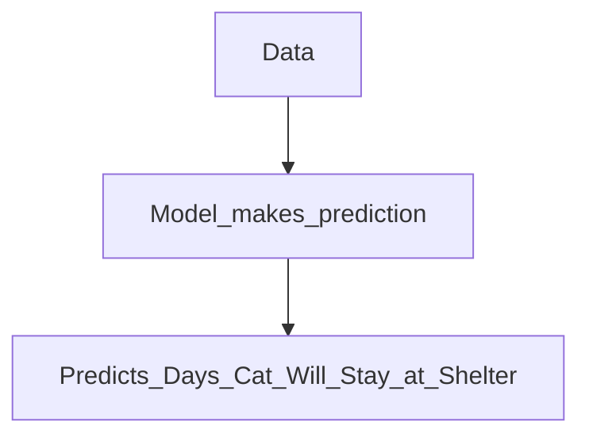
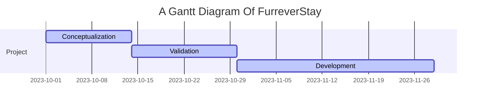

# team-3
**Link to live demo:** [link](https://furrever-stay.streamlit.app/)

**Link to project plans:** [link](https://docs.google.com/document/d/1AmtaymPJmyJYC26llHr9EapXFngMpI09pPshSX5K-So/edit#heading=h.jn1i75j0vqs6)
**Link to dataset:** [Link to project dataset](https://data.longbeach.gov/explore/dataset/animal-shelter-intakes-and-outcomes/table/?flg=en-us&disjunctive.animal_type&disjunctive.primary_color&disjunctive.sex&disjunctive.intake_cond&disjunctive.intake_type&disjunctive.reason&disjunctive.outcome_type&disjunctive.outcome_subtype&disjunctive.intake_is_dead&disjunctive.outcome_is_dead&sort=-outcome_date&dataChart=eyJxdWVyaWVzIjpbeyJjaGFydHMiOlt7ImFsaWduTW9udGgiOnRydWUsInR5cGUiOiJjb2x1bW4iLCJmdW5jIjoiQ09VTlQiLCJ5QXhpcyI6ImFnZSIsInNjaWVudGlmaWNEaXNwbGF5Ijp0cnVlLCJjb2xvciI6InJhbmdlLWN1c3RvbSIsInBvc2l0aW9uIjoiY2VudGVyIn1dLCJ4QXhpcyI6ImludGFrZV9kYXRlIiwibWF4cG9pbnRzIjpudWxsLCJ0aW1lc2NhbGUiOiJtb250aCIsInNvcnQiOiIiLCJzZXJpZXNCcmVha2Rvd25UaW1lc2NhbGUiOiIiLCJzZXJpZXNCcmVha2Rvd24iOiJpbnRha2VfaXNfZGVhZCIsInN0YWNrZWQiOiJub3JtYWwiLCJjb25maWciOnsiZGF0YXNldCI6ImFuaW1hbC1zaGVsdGVyLWludGFrZXMtYW5kLW91dGNvbWVzIiwib3B0aW9ucyI6eyJmbGciOiJlbi11cyIsImRpc2p1bmN0aXZlLmFuaW1hbF90eXBlIjp0cnVlLCJkaXNqdW5jdGl2ZS5wcmltYXJ5X2NvbG9yIjp0cnVlLCJkaXNqdW5jdGl2ZS5zZXgiOnRydWUsImRpc2p1bmN0aXZlLmludGFrZV9jb25kIjp0cnVlLCJkaXNqdW5jdGl2ZS5pbnRha2VfdHlwZSI6dHJ1ZSwiZGlzanVuY3RpdmUucmVhc29uIjp0cnVlLCJkaXNqdW5jdGl2ZS5vdXRjb21lX3R5cGUiOnRydWUsImRpc2p1bmN0aXZlLm91dGNvbWVfc3VidHlwZSI6dHJ1ZSwiZGlzanVuY3RpdmUuaW50YWtlX2lzX2RlYWQiOnRydWUsImRpc2p1bmN0aXZlLm91dGNvbWVfaXNfZGVhZCI6dHJ1ZX19fV0sImRpc3BsYXlMZWdlbmQiOnRydWUsImFsaWduTW9udGgiOnRydWUsInRpbWVzY2FsZSI6IiJ9&refine.animal_type=CAT&q.to_date.intake_date=intake_date%3C%3D%222023-10-21%22)

**Link to project description:** [link](https://hackmd.io/@H1rmcYbFSwOYUwgYururYA/Sk71PmXxT)

**Link to project plans:** [link](https://docs.google.com/document/d/1AmtaymPJmyJYC26llHr9EapXFngMpI09pPshSX5K-So/edit#heading=h.jn1i75j0vqs6)

Furrever Stay
===

## Table of Contents
**[Overview and Objectives](#overview-and-objectives)** 
**[Motivation](#motivation)** 
**[User Flows](#user-flows)** 
**[Project Timeline](#project-timeline)** 
**[Data Source](#data-source)** 
**[Methodology](#methodology)** 
**[Expected Outcomes](#expected-outcomes)** 
**[Implementation Plan](#implementation-plan)** 
**[Future Features](#future-features)** 

## Overview and Objectives

Welcome to Furrever Stay, a project designed to predict the duration a cat may spend in a shelter based on its individual traits. Our objective is to prioritize cats at risk of extended shelter stays for adoption, contributing to the overall well-being of sheltered animals. Inspired by the research paper ["Increasing adoption rates at animal shelters: a two-phase approach to predict length of stay and optimal shelter allocation"](https://https://bmcvetres.biomedcentral.com/articles/10.1186/s12917-020-02728-2) Furrever Stay aims to enhance the adoption process at animal shelters.

**Project Objectives**
* Predict the duration a cat may spend in a shelter using individual traits.
* Help shelters prioritize cats with a higher risk of extended shelter stays for adoption.

**No cat should be left without a loving home or end up being euthanized!**

## Motivation 
Animal shelters grapple with the task of optimally distributing resources to care for and rehome animals. In response to this challenge, Furrever Stay has emerged with a mission to enhance efficiency by forecasting the duration of a cat's stay and prioritizing those at risk of prolonged residency. By strategically identifying and prioritizing cats during adoption events, we aim to empower shelter caretakers to focus their efforts where they are most needed. Recognizing the limitations on caretaker capacities, this approach not only aids in resource allocation but also significantly boosts adoption rates, ensuring that more cats find their forever homes

**As Shown In this graph taken from City of Long Beach Animal Shelter Data, there is an increase of over 2000 cats from 2022 to 2023. Shelters are overcapacity.**

Source: [City of Long Beach Animal Care Services](https://tinyurl.com/2zy4bjuy)
 
## User flows
---

The user will input the characteristics of the cat by using the drop down menu on the website

**gif of the action**

After inputting the characteristics, the website will give the user a prediction of how long the cat will stay

**gif of that happening**

> Read more about sequence-diagrams here: http://bramp.github.io/js-sequence-diagrams/

## Project Timeline
---

> Read more about mermaid here: http://mermaid-js.github.io/mermaid/

## Data Source

the final dataset that worked the best for us, either texas, sonoma, long beach, etc.

## Methodology
Furrever Stay employs a predictive modeling approach inspired by the research paper "Increasing adoption rates at animal shelters: a two-phase approach to predict length of stay and optimal shelter allocation." This methodology involves analyzing individual traits of cats to create a predictive model for shelter stay duration.

**Model used name**

## Expected Outcomes
* Identification of factors influencing cat shelter stay durations.
* A predictive model for estimating the length of stay for individual cats.

## Implementation Plan
* Conduct exploratory data analysis on shelter records.
* Preprocess data for model training.
* Train predictive models based on the two-phase approach.
* Evaluate model performance and fine-tune as needed.

## Future Features
Currently, our system allows users to input the characteristics of a single cat for analysis. However, our future objective is to enhance the functionality to process datasets provided by users, such as Excel files in CSV format, enabling the system to generate predictions and insights for multiple cats simultaneously. This expansion will offer users a more efficient experience.

license team-3

